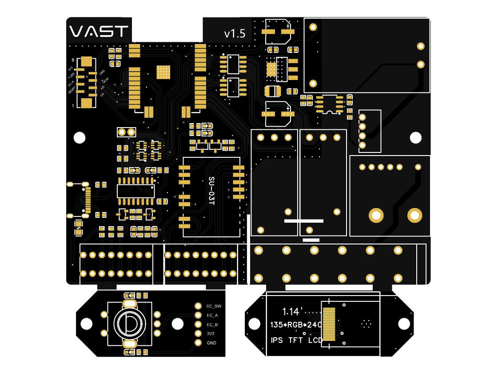
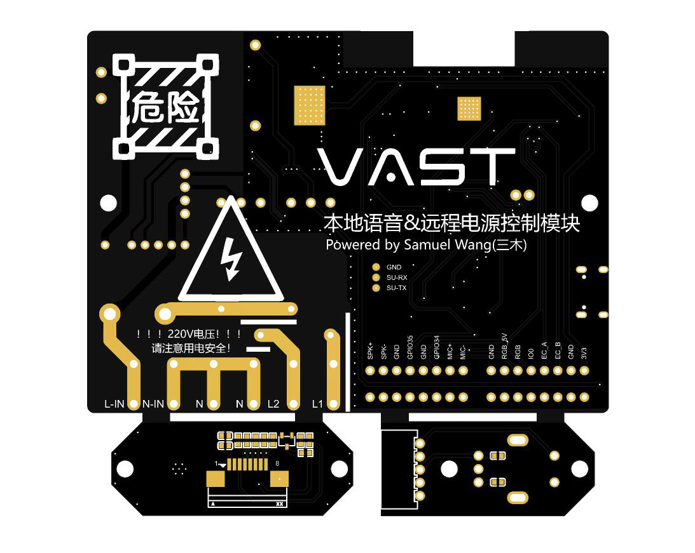

# Vast Power

本项目原本是因为自己的一些需求而设计，顺便也为将来可能的项目进行前期试水。

## 主要功能

* 可与Home Assistant智能家居系统互联，实现远程控制的目的
* 离线语音控制，可直接控制灯光、继电器等
* 高精度电量统计模块，可精准统计负载耗电量
* 2路16A磁保持继电器
* RGB端口，可用于控制灯光（建议使用100珠及以上SK6812灯带）
* SPI屏幕接口，可外接显示屏自定义显示内容
  * 亦可用于扩展其他SPI设备
* 编码器接口，可外接编码器
  * 亦可拓展为3路输入输出IO（GPIO0受限使用，ESP32启动时不能为低电平）
* 2路ADC接口，或者用于2路IO输入

## 技术依赖

* ESP32程序使用[ESPHome](https://esphome.io/)构建
* 离线语音基于[智能公元](http://www.smartpi.cn/)定制的语音固件

## PCB

嘉立创制造文件 [Gerber_PCB_vast-power_2022-12-20](Gerber/Gerber_PCB_vast-power_2022-12-20.zip)
焊接辅助文件 [PCB_vast-power_2022-12-20](Gerber/PCB_vast-power_2022-12-20.html)

## BOM

主要元器件都提供了立创商城元器件编码，可直接导入BOM表购买。

BOM文件 [bom_board_vast-power_2022-12-20](BOM/bom_board_vast-power_2022-12-20.xlsx)

## 3D打印外壳文件

3D打印外壳文件 [上盖](STLs/3DShell_vast-power_T.stl) [下盖](STLs/3DShell_vast-power_B.stl)

## 接口介绍

## 固件

* ESP32固件
  * [查看](Firmware/ESPHome/)
* SU-03T固件
  * 固件 [su_03t_release_update_20221219001_1.1.9](Firmware/SU-03T/su_03t_release_update_20221219001_1.1.9.bin)
  * 烧录软件 [Hummingbird-M-Update-Tool](https://docs.aimachip.com/zh_CN/latest/_static/document/SU-03T/Hummingbird-M-Update-Tool.zip)

## ESP32与SU-03T互动

ESP32与SU-03T通过UART接口互动，具体消息内容请参考下方介绍。

- SU-03T发送给ESP32消息内容及意义

10 11  开照明灯
10 10  关照明灯
10 21  开氛围灯
10 20  关氛围灯
20 11  调亮灯光
20 10  调暗灯光
30 11  打开电源
30 10  关闭电源
40 01  暂停打印
40 10  恢复打印
40 11  取消打印
50 00  打印进度

- ESP32发送给SU-03T的消息内容及意义

AA 55 01 00 00 00 00 55 AA   关闭电源判断返回，打印中
AA 55 02 01 00 00 00 55 AA   关闭电源判断返回，未打印
AA 55 03 01 00 00 00 55 AA   开始OTA
AA 55 04 01 00 00 00 55 AA   结束OTA
AA 55 05 00 01 02 55 AA   打印进度返回，00对应进度百分比数字，01对应剩余小时数字，02对应剩余分钟数字

## 显示屏logo文件

Logo文件下载 [PSD](images/voron_design_logo.psd)

## FAQs

待补充
