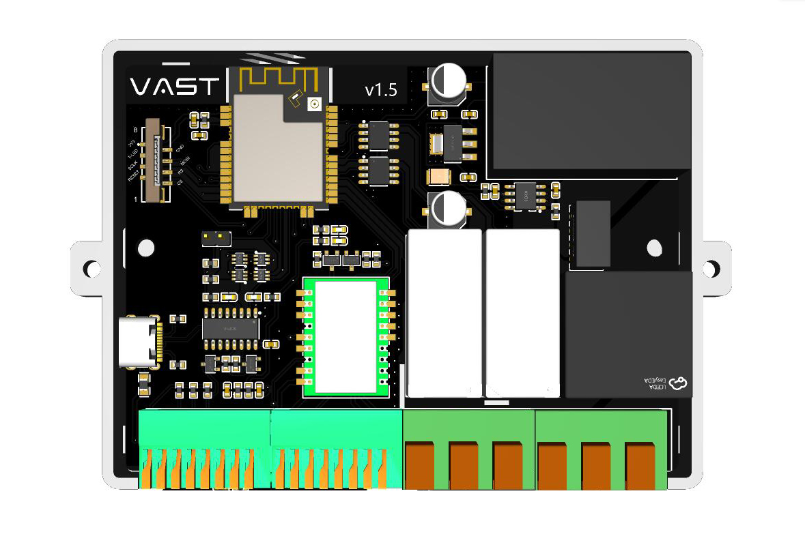
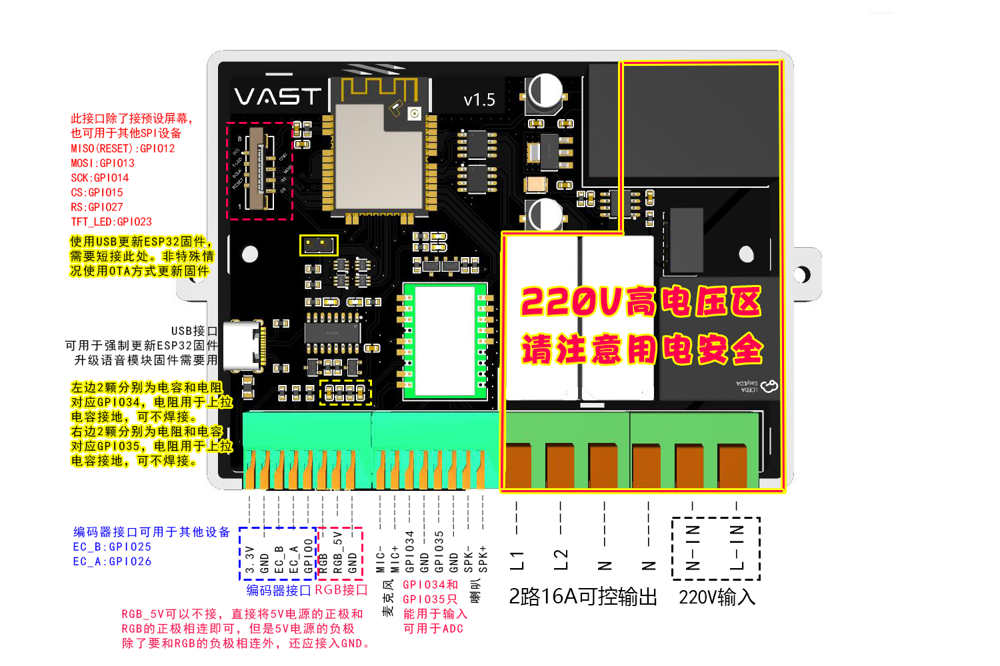
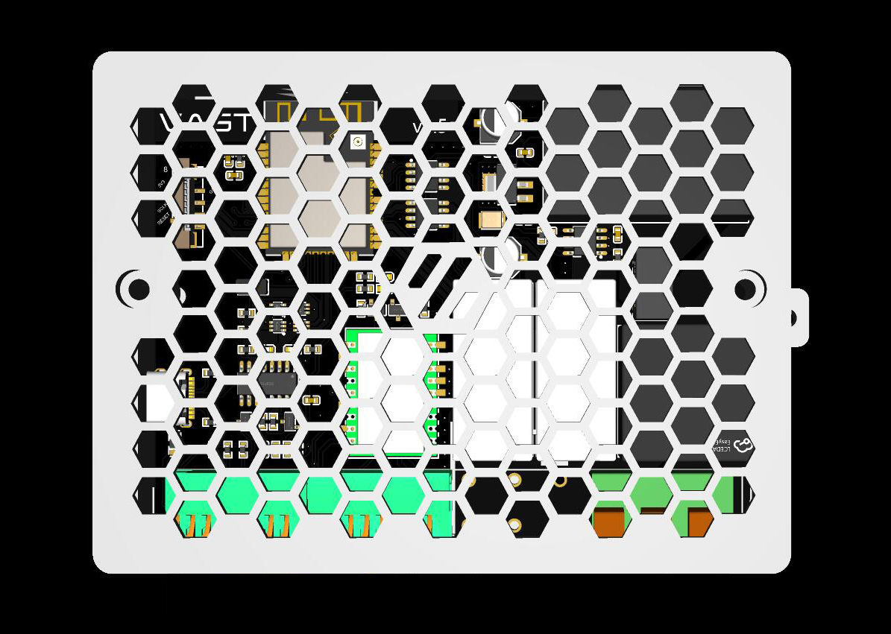

# Vast Power

本项目原本是因为自己的一些需求而设计，顺便也为将来可能的项目进行前期试水。

## 主要功能

* 可与Home Assistant智能家居系统互联，实现远程控制的目的
* 离线语音控制，可直接控制灯光、继电器等
* 高精度电量统计模块，可精准统计负载耗电量
* 2路16A磁保持继电器
* RGB端口，可用于控制灯光（建议使用100珠及以上SK6812灯带）
* SPI屏幕接口，可外接显示屏自定义显示内容
  * 亦可用于扩展其他SPI设备
* 编码器接口，可外接编码器
  * 亦可拓展为3路输入输出IO（GPIO0受限使用，ESP32启动时不能为低电平）
* 2路ADC接口，或者用于2路IO输入

## 技术依赖

* ESP32程序使用[ESPHome](https://esphome.io/)构建
* 离线语音基于[智能公元](http://www.smartpi.cn/)定制的语音固件

## 接口介绍

## PCB

PCB制造文件及相关说明[查看](Gerber/)

## BOM

主要元器件都提供了立创商城元器件编码，可直接导入BOM表购买。

BOM文件 [bom_board_vast-power_2022-12-20](BOM/bom_board_vast-power_2022-12-20.xlsx)

## 3D打印外壳文件

3D打印外壳文件
  * [上盖](STLs/3DShell_vast-power_T.stl) 
  * [下盖](STLs/3DShell_vast-power_B.stl)

## 固件

固件及相关说明[查看](Firmware/)

## 显示屏logo文件

Logo文件下载 [PSD](images/voron_design_logo.psd)

## FAQs

待补充
